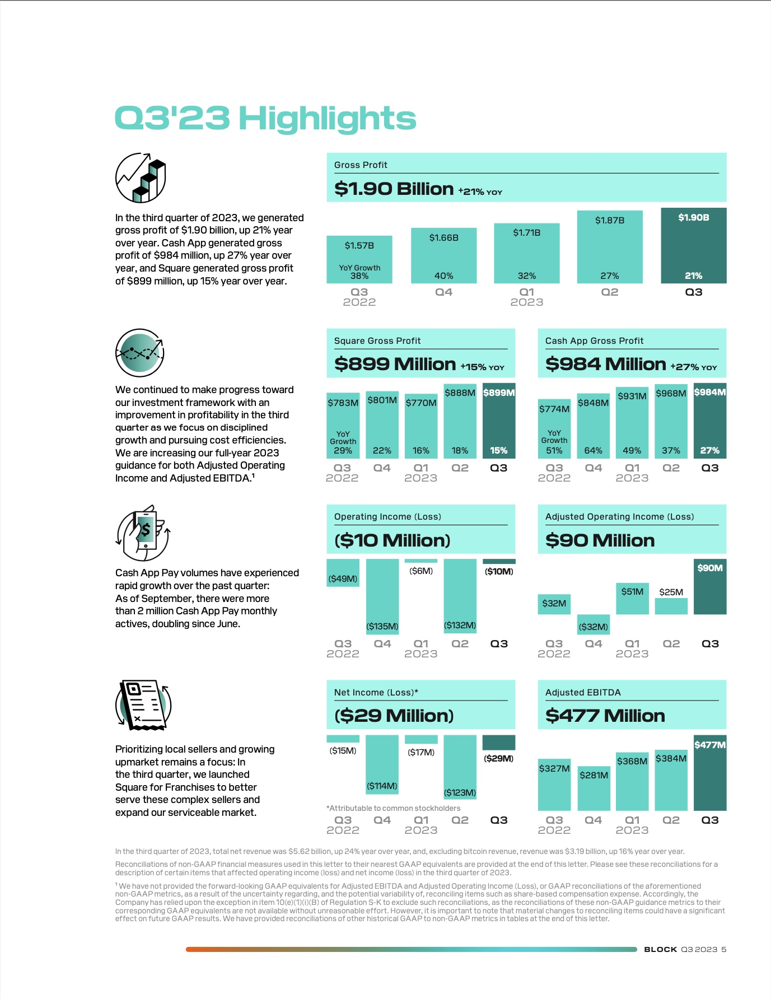

#### Module 1 Challenge: Case Study
##### Anvitha Chaluvadi

# **[Cash App](https://cash.app/)** 

 
 

## Overview and Origin
### **<ins>What is Cash App?</ins>**

 
By using [Cash App](https://cash.app/), users can send, receive, request, and invest money peer-to-peer for free. In general, it is a mobile payment platform that offers one a convenient and cashless way to handle financial transactions. It creates a financial ecosystem that fosters user engagement. "Cash App is a financial service platform, but not a bank. Bank services are provided by Cash App's bank partners." **(CASH APP)** A user can pay someone by their number, email, or their username ($cashtag). Additionally, they can scan their peer's QR code from the app directly. A user can see their balance automatically update as they make payments to confirm that their transactions have gone through.

Not only is Cash App used for personal transactions, you can also use it to send and receive stocks and bitcoin. **(TIME)** One can purchase stocks using one's funds in their Cash App balance. If there are insufficient funds in their Cash App balance, the remaining balance would be debited from their linked debit card. Additionally, stocks can be scheduled any time of the day (24/7), but would be completed during market hours. You can set up automatic purchases of stock every day, every week, or 2 times a week.**(CASH APP)**

Rather than dealing with the time-consuming nature and expensive fee of a bank. Cash App makes it easier for one to manage their money. The platform is easy to use and provides a user-friendly interface. It allows them to access their investments quickly and efficiently on the go. Also, it provides its users with a secure digital wallet to store their money.

Given its wide range of features and capabilities, Cash App is ideal tool for managing one's finances.

### **<ins>When was the company incorporated?</ins>**
 The company was incorporated on October 15, 2013. It was formerly known as Square Cash before it became Cash App. **(WIKI)**

### **<ins>Who are the founders of the company?</ins>**

Cash App is operated and developed by [Block Inc](https://block.xyz/). formerly known as Square Inc. It was officially renamed in December, 2021. It is based in San Francisco, California and it is "a leader in the financial technology industry"**(TIMES)**. Block Inc. and Cash App founders are Jack Dorsey and Jim McKelvey.**(WIKI)** Dorsey founded Block Inc. and McKelvey serves as the Chief Technology Officer at Block Inc. and Cash App. **(BITKAN)**

* Jack Dorsey
   * Dorsey is the CEO of Block Inc. Although, at the time, Dorsey owned Twitter, Cash App was not affiliated with it.
   * As an entrepreneur, Dorsey started his first company, Block Inc, it was a mobile-payments company that provided credit-card transaction devices and software. By 2012, it had over two million users.

* Jim McKelvey
   * McKelvey co-founded Block Inc. with Dorsey after he had trouble selling a $2,000 art piece from his studio. He also co-founded Twitter alongside Dorsey. He owns 5% of Block and has a net income of $270 million from selling Block shares.
   * As an entrepreneur, he has at least 7 companies that range from a CD cabinet maker to a glass blowing studio

Notable Staff:
* Keith Rabois:
Former COO/VP Engagement & Strategy Cash App

* Tom Kakuei:
Former VP Engineering & Engagement, now EVP Strategic Initiatives for Cash App.

### **<ins>How did the idea for the company (or project) come about?</ins>**

 The idea was created in 2013 during a company hackathon. It was developed with a purpose to make electronic payments between peers simple for things like splitting a bill at a restaurant or separating/sharing costs for an AirBnB rental.

The concept of cost splitting was not new given the presence of Venmo as well as Google’s P2P payments functionality. Square’s product was not that sophisticated when it was initially introduced. **(FINTECH TAKES)**

### **<ins>How is the company funded? How much funding have they received?</ins>**

Their income is derived from users withdrawing funds from the app to their linked bank accounts. **(WIKI UNDER FINANCES)**. Furthermore, Cash App primarily generates revenue by charging fees for transactions specific to businesses and individuals, such as subscription services and selling Bitcoin to customers. They offer 2 types of deposits to their users, which includes standard and instant. **(CASH APP WEBSITE)**

* Standard Deposit:
  * Free and can arrive 1-3 business says to their bank account.

* Instant Deposit:
  * 0.5%-1.75% fee (with a minimum fee of $0.25) and is instant to their debit card. Sending from a credit card would be subject to a 3% fee.

An additional revenue source is through its subscription services, such as Cash Cards. A Cash Card is a physical or digital debit card that allows users to make purchases directly linked to their Cash App balance instead of their bank balance. Cardholders also have the option to add the card to their Apple Wallet. 

Cash App's largest revenue generator is its Bitcoin segment. Not only is there a 1% to 4% in what Bitcoin exchanges and individuals pay for Bitcoin, but there is a service fee that is charged for selling Bitcoin to its customers. Cash App is able to generate additional revenue on the exchange it facilitates by factoring these differences into the price it offers its users. **(INVESTOPEDIA)**

Additionally, they received external funding from various investors. They have raised a total of $1.9 billion in funding, "which saw profits rise 27% and 15%, respectively, from a year earlier." **(BBN BLOOMBERG)**

## Business Activities

### **<ins>What specific financial problem is the company or project trying to solve?</ins>**

> “Our competitors have seen that, and definitely take advantage of the fact that we have a gap specifically in outbound sales,” Dorsey said at the bank’s global technology, media and communications conference. “And we’re figuring out more of a balance there, and not being so stubborn about being technology-first and -focused.” **(PAYMENT DIVE)**

Cash App and Block Inc. are expanding efforts to develop services that are more personalized and provide the general population with tools that allow them to make more informed decisions through AI. 

### **<ins>Who is the company's intended customer?  Is there any information about the market size of this set of customers?</ins>**
 
 Cash App initially developed its services tailoring it to teen demographic. However, today, minors and adults use the app. If a minor obtains permission from their parent(s), they gain expanded access and use features like direct deposit, bitcoin, and stocks. 
 
 Cash App is also more likely to be used by low-income consumers in the U.S. According to data from Pew Research Center, which was released in September of 2022, lower-income consumers comprised twice the share than of upper-income consumers using Cash App in the U.S., specifically by 36% to 18%. **(PAYMENT DIVE)**

 Additionally, Pew Research Center discovered the usage of users by age group.

* More Likely to use Cash App
 
    * 40% - 18 to 19 year olds
    * 30% - 49 years olds

* Less Likely to use Cash App

    * 19% - 50 to 64 year olds
    * 9% - 65+ years olds 

Cash App is available both in the U.S. and the U.K. When a user sends money between the U.K or the U.S., "Cash App will convert the payment from the origin currency to the destination currency based on the mid-market exchange rate at the time the payment is created" **(TIMES)**

Small businesses and entrepreneurs are another target population that utilize Cash App. They are able to connect with customers by sharing their Cash App QR code, $Cashtag (username), email, or phone number associated with their account. Businesses can be paid instantly through Cash App. A business account, Cash for Business, can be created for free and would not need any hardware to process business payments. However, there is a fee for business transactions. Accounts do not pay fees for instant deposits to a business's checking account. **(TIMES)**

### **<ins>What solution does this company offer that their competitors do not or cannot offer? (What is the unfair advantage they utilize?)</ins>**

Cash App beats its competitors by encouraging user loyalty and retention through its unique services. It also has a benefit by fostering relationships with its partner retailers, which provide users with exclusive deals and promotions. Overall, its reputation and user trust gives it a competitive edge over other competitors.

**Note:** A user can choose to save money on this platform through the "Money" tab. It allows them to set savings goals and track them.**(TIME)** Additionally, if a user has a Cash Card they can turn on the "Rounds Up" feature and save changes for a their purchase. Essentially, they can purchase items while putting money on the side. **(TIMES)**

### **<ins>Which technologies are they currently using, and how are they implementing them? (This may take a little bit of sleuthing–– you may want to search the company’s engineering blog or use sites like StackShare to find this information.)</ins>**

Cash App leverages several cutting-edge technologies to provide seamless and a secure user experience.

It utilizes state-of-the-art secure encryption algorithms to protect user data and their financial transactions. Cash App is a PCI Data Security (PCI-DSS) Level 1 compliant, which is the highest level of compliance and payment standards merchants can comply with to securely store, transmit, and process credit card information. **(CASH APP & ALL ABOUT COOKIES)** If users were to use public or private Wi-Fi or data (3G, 4G, etc.), then their data and sensitive information would be protected from unauthorized entities, as that information would be encrypted and sent securely to Cash App’s servers. As added protection, Cash App offers two-factor authentication.  

Not only does Cash App use encryption. It also utilizes cloud computing technology, like Google Cloud, and artificial intelligence (AI) research firm Dessa to strengthen "Cash App's existing solutions and drive innovation mechanisms to improve customer experience and increase accessibility to bank services." **(GOOGLE CLOUD)**. Machine learning (ML) technology can help with the enhancement of products in areas of customer engagement, risk management, and more. By acquiring Dessa, they not only further their machine learning abilities, but improve their products and pass on benefits to customers around the world. They can support the Dessa team and other Square product teams by continuing to hire top ML and AI talent. They also "opted to use Google Cloud AI and machine learning (ML) solutions and NVIDIA's graphic processing units (GPUs) to handle the immense compute demands of its applied AI efforts." Essentially, they would be able to handle the large volume of transactions and user requests, ensuring a smooth and uninterrupted user experience. In turn, Block Inc.’s data scientist would be able to conduct data-heavy, processing-intensive initiatives. 

Another technology that Cash App uses is near-field communication (NFC). NFC enables users to make contactless payments by simply tapping their smartphones or their Cash Cards against payment terminals/readers, offering a convenient method for in-person transactions. **(CASHAPP)**

Cash App utilizes and leverages these technologies to provide a seamless payment experience for its users.

## Landscape

### **<ins> What domain of the financial industry is the company in?</ins>**

Cash App is in the mobile payment services domain in the financial industry. **(WIKI)**

### **<ins> What have been the major trends and innovations of this domain over the last 5–10 years?</ins>**

### **<ins>What are the other major companies in this domain?</ins>**
    
 

 
 

 * [PayPal](https://www.paypal.com/) 
   * PayPal is an online payment platform that allows users to send and receive money around the world. PayPal facilitates the ability to make purchases online with participating stores when you link to your bank account through a credit or debit card. PayPal also possesses the role of middleman between your bank and merchants to keep you payment information secure. **(BANKRATE)** Additionally, you can use PayPal to securely send money to friends and family, and receive money from others. 

 

 
 

 
 * [Venmo](https://venmo.com/) 
   * Venmo is a mobile app that makes peer-to-peer money transfers simple and inexpensive or free. Venmo is mobile-only, preventing users from sending or receiving payments on a website or computer; Users can also use the app such purposes. Venmo’s goal is to help those who need assistance with splitting checks and other similar situations. You can also use it to request money from people.  

 

 
 

 
 * [Zelle](https://www.zellepay.com/)
   * Zelle is a peer-to-peer payment service, allowing users to digitally send money to each other. Over 1,000 banks and credit unions are partnered with Zelle. This service is also automatically included with the institution’s app. Zelle works by linking your checking or savings account and transferring money to another U.S. bank account. Neither payer or payee need to be in the same financial institution as long as it has Zelle. Users can send money from the institution’s app or the Zelle app; that money is automatically deposited within minutes into the recipient’s bank account that they linked to their Zelle account; there are no fees. However, it does not work with business debit cards, credit cards, international accounts, and gift cards. Some banks may allow you to set up a Zelle business account, but the bank might charge a small fee using Zelle; also, consumers need to have Zelle in order to make payments.  

 
 

 * [Apple Pay](https://www.apple.com/apple-pay/)
   * Apple Pay provides a secure and an efficient way to make payments on any Apple device. Apple pay can also be used in iMessages for a business or extension. Users can quickly and securely provide payment, shipping, and contact information to check out. It is faster than other payment methods and checkout can be done by a single touch. Customers can complete their purchase from simply clicking the "Buy with Apple Pay'' button.
        

 
 

 * [Google Pay](https://pay.google.com/about/)
   * Google Pay is a mobile wallet and is most accessible for Android. You can use Google Pay to pay for items when you check out online, making purchases in-store, paying in-app purchases, or sending and receiving payments from others. When someone pays a user or receives cash-back rewards, the user's money is stored in their account balance, which can then be transferred into their bank account. You can also send and request money using the mobile app. Also, you can use it to split a bill. In order to pay someone, you have to add money into your Google Pay Account. 
       

## Results

* What has been the business impact of this company so far?

### **<ins> What are some of the core metrics that companies in this domain use to measure success? How is your company performing, based on these metrics?</ins>**

* Financial measures and key metrics they utilize: 
   * Gross Payment Value (GPV)
   * Adjusted EBITDA
   * Adjusted Net Income (Loss)
   * Diluted Adjusted Net Income(Loss) Per Share (Adjusted EPS)
   * Adjusted Operation Income (Loss)
   * Adjusted Operating Income (Loss) margin
   * constant currency
   * Adjusted Free Cash Flow
   * non-GAAP operating expenses as well as other measures defined in this letter such as measures excluding bitcoin revenue, measures excluding gross profit contributions from our BNPL platform, and measures excluding PPP loan forgiveness gross profit. 

* How is your company performing relative to competitors in the same domain?

## Recommendations

* If you were to advise the company, what products or services would you suggest they offer? (This could be something that a competitor offers, or use your imagination!)
  
  Cash App should work on international transfers like Venmo.

* Why do you think that offering this product or service would benefit the company?

The international transfers will increase their client base and inturn their profits. 

* What technologies would this additional product or service utilize?

This could be done by using or adding an internatinal currency exchange feature in their app. 

* Why are these technologies appropriate for your solution?

Adding international currency exchange feature will make it easier for clients to transfer money outside of the U.S. to all other countries in the world. 
## Resources
* Overview and Origin

[Wikipedia - Cash App](https://en.wikipedia.org/wiki/Cash_App)

[Forbes - What is Cash Ap and How Does Tt Work?](https://www.forbes.com/advisor/money-transfer/what-is-cash-app/)

[BITKAN - Who are the Founder of Cash App? What Does Cash App Look Like?](https://bitkan.com/learn/who-are-the-founders-of-cash-app-what-does-cash-app-look-like-11714)
 (Q3)

[TIMES - What is Cash App and How Does It Work?](https://time.com/personal-finance/article/what-is-cash-app/#:~:text=It%20was%20launched%20in%202013,fees%20that%20usually%20accompany%20banking.) (Q1)

[Fintech Takes - Cash App is Culture](https://newsletter.fintechtakes.com/p/cash-app ) (Q4)

[Cash App - Cash Out Speed Options](https://cash.app/help/us/en-us/3073-cash-out-speed-options#:~:text=Cash%20App%20offers%20standard%20deposits,instantly%20to%20your%20debit%20card.) (Q5).

[BBN Bloomberg - Block Soars on Boosted Adjusted Profit Outlook as Cash App Grows](https://www.bnnbloomberg.ca/block-soars-on-boosted-adjusted-profit-outlook-as-cash-app-grows-1.1993336)
 (Q5)
 
[Block Q3 2023 Shareholder Letter](https://s29.q4cdn.com/628966176/files/doc_financials/2023/q3/Block_3Q23_Shareholder-Letter.pdf) (Q5)

 [Investopedia - How Cash App Makes Money](https://www.investopedia.com/articles/company-insights/090916/how-square-cash-works-and-makes-money-sq.asp#:~:text=as%20an%20example.-,Cash%20App's%20Financials,and%20selling%20Bitcoin%20to%20customers.) (Q5)

* Business Activities

[Payment Dive - Cash App Pursues Older, Affluent Customers](https://www.paymentsdive.com/news/cash-app-older-affluent-customers-block-jack-dorsey-square-clover-toast-payments/651114/#:~:text=By%20age%20group%2C%20nearly%2040,who%20used%20it%2C%20Pew%20discovered.) (Q2)

[Oberlo - How Many People Use Cash App](https://www.oberlo.com/statistics/how-many-people-use-cash-app) (Q2)

[FourWeekMBA - How Does Cash App Make Money](https://fourweekmba.com/how-does-cash-app-make-money/#:~:text=Competitive%20Advantage&text=%E2%80%93%20Positions%20Cash%20App%20as%20a,provide%20exclusive%20deals%20and%20promotions.) (Q3)

[Google Cloud - Cash App uses Google Cloud to power mobile payments innovation and research](https://cloud.google.com/blog/products/ai-machine-learning/cash-app-uses-google-cloud-ai-nivida-gpus-to-power-mobile-payments) (Q4)

[Square - Welcoming the Dessa Team to Square](https://squareup.com/us/en/press/dessa-joins-square) (Q4)

[Cash App - Cash App Security](https://cash.app/help/us/en-us/5144-cash-app-security#:~:text=Cash%20App%20is%20PCI%20Data,as%203G%2C%204G%20and%20EDGE.) (Q4)

[All About COOKIES - How To Protect Yourself Against Cash App Scams](https://allaboutcookies.org/cash-app-scams#:~:text=Cash%20App%20uses%20encryption%20and,app%20offers%20two%2Dfactor%20authentication.) (Q4)

* Landscape

[Bankrate - What is PayPal? A complete guide](https://www.bankrate.com/finance/credit-cards/guide-to-using-paypal/) (Q3)

[Bankrate - Guide to using Venmo](https://www.bankrate.com/finance/credit-cards/how-to-use-venmo/) (Q3)

[Bankrate - How to use Zelle: A beginner’s guide to digital payments](https://www.bankrate.com/banking/checking/how-to-use-zelle-beginners-guide-to-digital-payments/) (Q3)

[Apple Developer - Apple Pay](https://developer.apple.com/apple-pay/) (Q3)

[Intuit Credit Karma - What is Google Pay and how does it work?](https://www.creditkarma.com/money/i/what-is-google-pay) (Q3)

* Results
* Recommendations
